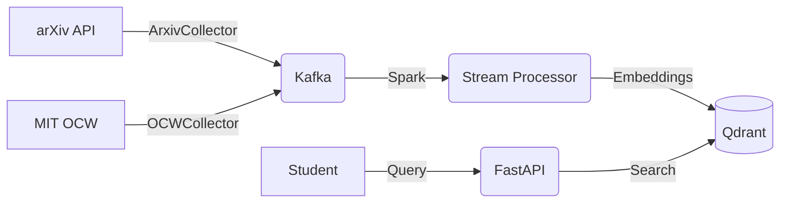

# 🎓 Atlas - Academic Search Engine

A semantic search engine for academic resources: research papers, lecture notes, and course materials.

## Architecture



## Resource Types

| Type           | Source  | Badge     |
| -------------- | ------- | --------- |
| Paper          | arXiv   | 🔵 Blue   |
| Lecture Slides | MIT OCW | 🟠 Orange |
| Course Notes   | MIT OCW | 🟢 Green  |
| Syllabus       | MIT OCW | 🟣 Purple |

## Quick Start

### 1. Start Infrastructure

```bash
docker-compose up -d --build
```

### 2. Run Stream Processor

```bash
docker-compose exec spark-dev python stream_processor.py
```

### 3. Start Frontend

```bash
cd search-ui
npm install
npm run dev
```

### 4. Access

| Service          | URL                             |
| ---------------- | ------------------------------- |
| Search UI        | http://localhost:3000           |
| API Docs         | http://localhost:8000/docs      |
| Qdrant Dashboard | http://localhost:6333/dashboard |

## Project Structure

```
├── collectors/           # Modular data collectors
│   ├── base.py          # BaseCollector class
│   ├── arxiv_collector.py
│   └── ocw_collector.py
├── producer.py          # Orchestrates collectors → Kafka
├── stream_processor.py  # Spark: Kafka → Embeddings → Qdrant
├── search_api.py        # FastAPI search backend
└── search-ui/           # Next.js frontend
```

## Running Modes

### Search Only (Minimal Resources)

```bash
docker-compose up -d qdrant search-api
cd search-ui && npm run dev
```

### Full Pipeline (Live Ingestion)

```bash
docker-compose up -d
docker-compose exec spark-dev python stream_processor.py
```
