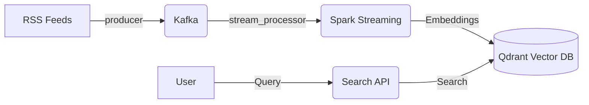

# Neural Search Engine

## Overview

A real-time semantic search engine for engineering blogs (Netflix, Uber, Airbnb, etc.).

- **Crawler (`producer.py`)**: Fetches RSS feeds and publishes articles to **Kafka**.
- **Stream Processor (`stream_processor.py`)**: a **Spark** job that consumes articles, generates embeddings using `SentenceTransformers`, and indexes them in **Qdrant**.
- **Search API (`search_api.py`)**: **FastAPI** backend that performs semantic search on the Qdrant index.

## Quick Start

### 1. Start Infrastructure

Start Kafka, Zookeeper, Qdrant, Producer, and API services:

```bash
docker-compose up -d --build
```

_Wait a minute for Kafka to be fully ready._

### 2. Run Stream Processor

Start the Spark streaming job to process and index articles:

```bash
docker-compose exec spark-dev python stream_processor.py
```

### 3. Start Frontend

Run the Next.js UI:

```bash
cd search-ui
npm install
npm run dev
```

_Open [http://localhost:3000](http://localhost:3000) to see the search interface._

### 4. Usage

- **Search Interface**: [http://localhost:3000](http://localhost:3000)
- **Search API Docs**: [http://localhost:8000/docs](http://localhost:8000/docs)
- **Qdrant Dashboard**: [http://localhost:6333/dashboard](http://localhost:6333/dashboard)

## Running Modes

### Option 1: Search Only (Save Resources)

If you only want to search existing data and don't need real-time updates, you can run a minimal stack:

```bash
docker-compose up -d qdrant search-api
```

- **Running**: Qdrant (DB), Search API, Search UI.
- **Stopped**: Kafka, Zookeeper, Producer, Spark (saves ~2-3GB RAM).

### Option 2: Live Updates (Full Stack)

To ingest new articles in real-time, you need the full stack:

```bash
docker-compose up -d
docker-compose exec spark-dev python stream_processor.py
```

- **Running**: Everything. New articles will appear in search results automatically.

## Architecture


